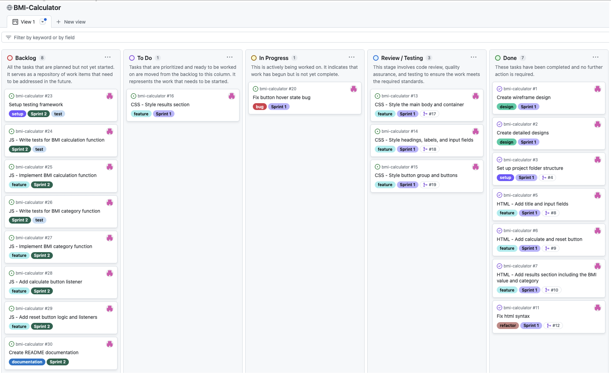
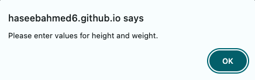

# BMI Calculator


Deployed to GitHub pages and can be viewed [**here**](https://haseebahmed6.github.io/bmi-calculator/)


## Project Overview

At my workplace, there is a huge focus on employee well-being, and as part of these efforts, we are creating a simple BMI (Body Mass Index) calculator web app. This BMI-calculator web app will be part of our broader employee wellness program and will play a key part in our employees being able to monitor their health related to their weight. The wider goal of this web app is to promote a healthy lifestyle which includes the likes of dieting and exercise, leading to overall improved employee health and well-being.

A BMI calculator is used to determine BMI of individuals, which is a numerical value calculated from their height and weight. The BMI can then be used to categorise individuals into different weight categories, such as underweight, normal weight, overweight, and obesity.

## Features

- **BMI calculation**: Calculates the BMI value using the weight and height inputs.
- **BMI categorisation**: Categorises into underweight, normal weight, overweight, and obesity based on the BMI value.
- **Reset functionality**: Allows users to reset the input fields and results.

## User Documentation

### Prerequisites

- Node.js
- npm (Node Package Manager)
- A modern web browser (e.g., Chrome, Firefox, Edge)

### Installation

1. Ensure node is installed:

   ```sh
   node -v
   ```

   if not already installed, click [here](https://nodejs.org/en/download/package-manager) to install Node

2. Ensure npm is installed:

   ```sh
   npm -v
   ```

3. Clone the repository:

   ```sh
   git clone https://github.com/HaseebAhmed6/bmi-calculator.git
   ```

4. Navigate to the project directory:

   ```sh
   cd bmi-calculator
   ```

5. Install the dependencies:

   ```sh
   npm install
   ```

## Usage

To use the BMI Calculator:

### Accessing the Deployed Application

- Visit the deployed application [**here**](https://haseebahmed6.github.io/bmi-calculator/).

### Running Locally

- Open the `index.html` file in your preferred web browser.

### Using the Application

1. Enter your height in cm and weight in kg.
2. Use the **Calculate** button to get your BMI value and category.
3. Use the **Reset** button to clear the input fields and results.

### Running tests

```sh
npm test
```

## Requirement Analysis

### Functional Requirements

- **User input**
  - Weight (kg)
  - Height (cm)
- **Calculate button**
- **BMI calculation**

  - Calculate BMI using the formula:

    BMI = weight (kg) / (height (cm)/100)^2

  - Display BMI value

- **BMI category**
  - Calculate the BMI category based on the value:
    - **Underweight:** BMI less than 18.5
    - **Normal weight:** BMI 18.5–24.9
    - **Overweight:** BMI 25–29.9
    - **Obese:** BMI 30 or greater
  - Display BMI category
- **Error handling**
  - Provide error messages for invalid input (e.g., negative values).
- **Reset button**
  - Allow the user to reset input fields and results.

### Non-Functional Requirements

- **Performance**
  - Fast load time
  - Quick calculations
- **Usability**
  - Intuitive and user-friendly
  - Clear labels and instructions
- **Compatibility**
  - Support for major web browsers
- **Maintainability**
  - Clean and well-documented codebase
  - Use of version control for tracking changes

## Design

Figma was used to create designs ranging from the initial wireframe design to highly detailed mock-up designs. The designs include the input fields, buttons and a result section to display the outputs.

### Wireframe Design


### Detailed Mockup Designs

Design 1


Design 2


Design 3


Design 3 was chosen as the final design due to its clean and minimalistic layout with the container containing all the components. The white container enhances visual clarity due to the contrasting background which ensures the functional components of the app stand out. In addition, the contrasting colours can also be seen for the reset and calculate buttons, where they enhance visual clarity and make the navigation process very simple for the user overall.

## Project Management

GitHub projects was used to manage the project overall by adopting agile methodology. In particular, scrum methodology was implemented to structure the project using sprints. Overall, the project was split into two sprints, where the first sprint focused on designing and creating basic HTML and CSS, and the second sprint focused on functionality using JavaScript, testing and documentation for the calculator. Below is a screenshot of our GitHub project board around the timeline of when sprint 1 was near its ending, and sprint 2 was about to start.



In order to track the progress of tickets, the GitHub projects board was customised to host sections ranging from backlog, to-do and in progress to review/testing and done. This ensured I could clearly visualise the progress of the overall development in the form of tickets relative to different stages and also other tickets on the board. In addition, the tickets were also tagged with labels for further clarity around the purpose of a ticket as well as linked PRs (pull requests) to illustrate explicit connection to the code being developed. Each ticket also had a branch associated with it to separate the overall development into smaller interconnected chunks. Furthermore, a strict format and structure was followed to create stories for the development of this BMI calculator which can be seen below.


Following a strict structure for each story ensures every story is similar in format and hence leading to overall consistency in tracking and management of the project. The format contained three sections:

### Background

The background section is used to provide overall context behind the need of the ticket. This may include explaining the current situation and why this task as part of this ticket is necessary, e.g. explaining a bug in the system.

### User Story

A use story aims to break down the task into a simple description by looking at it from the perspective of a specific stakeholder. This helps in aligning the overall focus for the task with a certain stakeholder and how it delivers value to the overall objective of the project.

### Acceptance criteria

The acceptance criteria aims to define clear conditions which must be met for the ticket to be considered done. This section helps avoid overall misunderstanding in the scope of the ticket and ensures everyone is clearly aligned on the expected outcome of the ticket.

## Development

### TDD (Test Driven Development)

Test-driven development is a methodology within software development, where tests are usually written before the actual code. The tests will normally test small pieces of functionality, which in our case was our calculate BMI and categorise functions. Using this methodology ensures the codebase is thoroughly tested as it is being developed and allows for bug-free software to be developed.

As per TDD methodology, unit tests for calculateBMI and getBMICategory functions were written before the development of the code itself. The tests initially were very minimal and aimed to just check the core functionality of the functions in terms of the BMI calculation and its categorisation logic. However, as we developed the codebase, more tests were added as different edge cases needed to be tested.

### Branching Strategy

The branching strategy adopted included a “devel” branch which was used as the base branch during development. All the feature branches were merged into “devel” rather than the “main” branch ensuring we protect and maintain a clean version of the main branch. The “devel” branch would only be merged into the “main” branch, once the full codebase was developed and tested.


In addition “main” and “devel” branches were also protected by:

- Restricting deletion
- Requiring a pull request before merging
- Blocking force pushes

These protection rules ensured a consistent development and branching method was enforced as well as preventing accidental pushes or deletions for the “devel” and “main” branches.


### Conventional Commits

Conventional commits were also adopted as part of this project, to ensure consistent and meaningful commit messages were being written. Using conventional commits leads to an explicit commit history, which makes it easier to understand the development of the project, and importantly track back on any issues and identify where they were introduced.

Conventional commit message structure:

```sh
<type>[optional scope]: <description>

[optional body]

[optional footer(s)]
```

Further details about conventional commits can be found [**here**](https://www.conventionalcommits.org/en/v1.0.0/).

## Code Implementation

After setting up the overall repository with the “devel” branch, branch protection and conventional commits structure in place, I started to develop the codebase.

- Index.html - I initially focused on creating the basic structure of the BMI calculator using HTML in the index.html file. The HTML file added the main components for the application, consisting of input fields, buttons and a results section. In addition, links to the CSS (styles.css) and JavaScript (script.js) were added to the HTML file to ensure a fully functional app can be developed.
- styles.css – After the basic structure of the application was in place using HTML, I created a styles.css file to design the application with various components such as colour, fonts, placement etc. This really brought the application to life and made it look visually appealing and easy to navigate.
- tests – After the visual aspect of the application was ready, I added tests for both functions, to ensure we can add JavaScript functionality with testing in place.
- script.js – After the testing in place, JavaScript was used to create the calculateBMI and getBMICategory functions, as well as listeners and logic for the buttons.

## Error Handling 
 

I used the alert() JavaScript method to display errors back to the user. This was used due to its ability to force the user to read the message and take the focus away from the current window.


## Testing

### Unit Testing and Integration Testing

Unit tests were written for the calculateBMI and getBMICategory functions, to test the outputs based on a variety of inputs.

Unit tests for the calculateBMI function based on:

- inputs = valid positive number
- inputs = null/missing
- inputs = 0
- inputs = negative number

Unit tests for the getBMICategory function based on:

- input = < 18.5
- input = 18.5 <= and =>24.9
- inputs = 25 <= and =>29.9
- inputs = 30 <=

Invalid values are not tested in the getBMICategory function as all necessary input validations are handled in the calculateBMI function.


Integration test aimed to test the functionality of both functions together as a whole rather than individually. Both functions were called as part of a single test with stimulated input values for both functions.

In addition, as part of CI (continuous integration), these tests would run automatically when a pull request to the “devel” or “main” branch was created, using the GitHub actions pipeline. GitHub action and CI is discussed further below in the report.

### Accessibility and Performance testing

Accessibility testing was carried out using Lighthouse which is an open-source tool developed by Google to analyse the quality of the application with respect to performance, accessibility, best practices and SEO.


1. Performance (100) – A score of 100 means the BMI calculator application is highly optimised for speed, ensuring it loads quickly and smoothly for a good user experience.
2. Accessibility (95) – A score of 95 suggests my application is highly accessible for a range of users and overall adheres to the web accessibility standards. However, there can be further changes made to optimise it further to potentially reach a score of 100.
3. Best Practices (96) – A score of 96 indicates that my application follows industry standards and best practices for web applications to a really high degree.
4. SEO (90) – A score of 90 for SEO would mean my application is very well optimised for search engines, and it would be easily discoverable in search engines, making it more visible in search results.

### Continuous Integration (CI)


The continuous integration pipeline above was created in YAML to run automated tests when a pull request to “devel” or “main” is created. This GitHub action installs all the npm dependencies in the environment and runs the test using:

```sh
npm test
```

This CI pipeline does not run on "push" to these branches, as pushing directly to the "devel" and "main" branch is restricted.


Running automated tests allows us to avoid any bugs or critical logical issues sneaking into the “devel” or “main” branch. This was helpful during the development phase as before the branch was merged, it would highlight any potential issues. However, this would be even more crucial if this application were to go to production with many users, as avoiding any bugs creeping into a production environment is really important for the credibility of the application.


## Evaluation

Overall, I’m really happy and satisfied with the outcome of this BMI calculator, particularly the design of it. I like the minimalistic design with really visually appealing colours, that make it really easy to navigate and use the calculator. In addition, I’m also happy with how I managed this project using GitHub projects alongside running two sprints which allowed me to split tasks effectively. Also being able to bring learnings such as consistent story writing templates, conventional commits and branching strategy/protection from my team at work into this project was really helpful and effective for me. It allowed me to bring industry practices which I have worked with into this project.

On the other hand, I feel I can further improve this application by implementing a code coverage solution such as Codecov to provide a holistic report which would further improve the quality and reliability of my application. A code coverage solution would be really helpful in identifying any untested code and addressing any gaps in our test suite. In addition, we can also try to increase applications accessibility score to 100, by potentially making fine tweaks to our design such as increasing colour contrast.